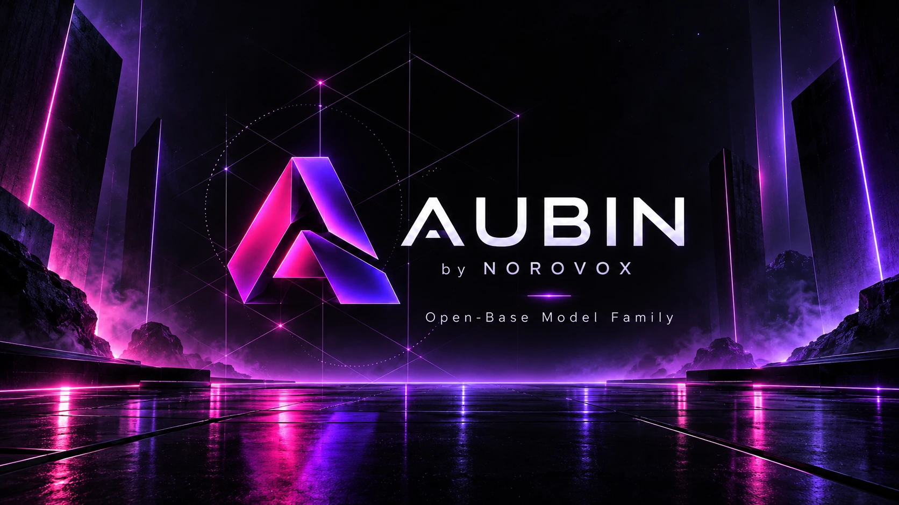

<div align="center">

<a href="https://huggingface.co/emrevrg/AUBIN-12B/resolve/main/media/aubin_family_en.mp4"></a>

### Open, calibrated decision models that see, act and learn.
**Typed decisions · computer use · real-time control · self-learning**, built on Gemma 4 by a 17-year-old in Türkiye.

[🎬 Watch the 80-second film](https://huggingface.co/emrevrg/AUBIN-12B/resolve/main/media/aubin_family_en.mp4) · [Türkçe](https://huggingface.co/emrevrg/AUBIN-12B/resolve/main/media/aubin_family_tr.mp4) · [Models on Hugging Face](https://huggingface.co/collections/emrevrg/aubin-by-norovox-6abbd944e3a7b80179422507) · [Support ❤](SUPPORT.md)

</div>

## At a glance

| | **AUBIN** | reference |
|---|---|---|
| Typed decisions ([Laya's benchmark](https://huggingface.co/datasets/LocalLLaMA/typed-decisions)) | **77.55 · #1** | meraGPT 76.8 · Laya 76.65 · Jev 72.7 |
| Jev's own published split | **8 of 8 metrics** | accuracy · Brier · ECE · NLL, both splits |
| Kev suites, sources Kev never saw | **89.8** | Kev-27B 89.6 |
| Kev suites, Kev's own training sources | 87.08 · NLL 0.43 | Kev-9B 87.4 · Kev-27B 87.0 · Kev-4B 86.5 |
| Visual computer use (ScreenSpot) | **67.7** | SeeClick 53.4 · CogAgent 47.4 · UI-TARS-7B 89.5 |
| Web agent (Mind2Web, cross-domain step success) | **43.5** | MindAct-XL 39.6 · GPT-4 26.4 |
| Real-time control (100 unseen episodes) | **92% · 0 lava deaths** | best rule + same shield 89% |
| FPS play with in-game self-learning (ViZDoom) | **18.3 kills / episode** | same model without learning 15.1 |

<sub>Every row is measured. Protocols, sample sizes and every variant tried are in [`reports/AUBIN_RESULTS_2026-10-03.md`](reports/AUBIN_RESULTS_2026-10-03.md). Where AUBIN is behind (Kev-9B on Kev's training sources; the strongest dedicated GUI-grounding models), the report says so.</sub>

## What's inside

| | |
|---|---|
| **AUBIN Omni** (`aubin/omni.py`) | One Gemma-4 base, every ability as a plug-in adapter, loaded lazily: `decide` · `click` · `web_step` · `act` · `learn` |
| **AUBIN Engine** (`aubin/engine.py`) | Tiered System-1/System-2. Learned skills answer in milliseconds, a fast model in about 0.25 s, a strong model with reasoning when needed. Abstains instead of a confident wrong answer. |
| **AUBIN-Learn** (`aubin/learn.py`) | Learns from feedback in milliseconds without retraining. `acquire_skill` adds a new skill only after a held-out self-test proves a gain. |
| **Server** (`aubin serve`) | HTTP · OpenAI-compatible `/v1/chat/completions` · **Laya/Jev-compatible `/v1/systemone`** · MCP |
| **Integrations** (`aubin/integrations.py`, `aubin-ts/`) | LangChain / LangGraph · LlamaIndex · CrewAI · TypeScript / Node / browser · Docker |
| **Reproduction** (`scripts/`) | Every training and evaluation script behind the numbers above |

## Quick start

```bash
pip install "git+https://github.com/Emrevrg/aubin"
```
```python
from aubin import Aubin, AubinOmni, AubinEngine

ai = Aubin("emrevrg/AUBIN-12B")
ai.decide("Billed twice for March, refund or we cancel.",
          {"team": {"type": "choice", "instructions": "Which team?", "criteria": {"billing": "payments", "tech": "bugs"}},
           "churn": {"type": "noul", "instructions": "Does the user threaten to cancel?"}})

omni = AubinOmni.from_hub("emrevrg/AUBIN-Omni", size="E4B")   # one base model, every ability
omni.click(screenshot, "open settings")                         # -> {"x": ..., "y": ...} on a 0-1000 scale
```
```bash
aubin serve --model emrevrg/AUBIN-12B --learn memory.npz
docker build -t aubin . && docker run --gpus all -p 8009:8009 aubin
```
More in [`INTEGRATION.md`](INTEGRATION.md).

## Models

| model | ability |
|---|---|
| [AUBIN-Omni](https://huggingface.co/emrevrg/AUBIN-Omni) | one model, every ability |
| [AUBIN-31B](https://huggingface.co/emrevrg/AUBIN-31B) · [AUBIN-12B](https://huggingface.co/emrevrg/AUBIN-12B) · [AUBIN-E4B-v3](https://huggingface.co/emrevrg/AUBIN-E4B-v3) | typed, calibrated decisions |
| [AUBIN-E4B-Screen](https://huggingface.co/emrevrg/AUBIN-E4B-Screen) | click on screenshots |
| [AUBIN-12B-Web](https://huggingface.co/emrevrg/AUBIN-12B-Web) · [AUBIN-E4B-Web](https://huggingface.co/emrevrg/AUBIN-E4B-Web) | web agent |
| [AUBIN-12B-Control](https://huggingface.co/emrevrg/AUBIN-12B-Control) · [AUBIN-E4B-Control](https://huggingface.co/emrevrg/AUBIN-E4B-Control) | real-time control, games |

## Support Norovox

**Built by a 17-year-old high school student: no sponsor, no budget, just free GPUs and AI subscriptions paid for with difficulty.**
Support goes into GPU compute, training, and the AI development tools this work depends on (such as Claude). Supporters are credited and get early access.
**zgremre@gmail.com** · **emrevrgdev@gmail.com** · [Why and how →](SUPPORT.md)

<sub>🇹🇷 17 yaşında bir lise öğrencisinin eseri: destekçisiz, bütçesiz; ücretsiz GPU'lar ve zorlukla ödenen yapay zekâ abonelikleriyle. Desteğin GPU'ya, eğitime ve bu işin dayandığı yapay zekâ geliştirme araçlarına (Claude gibi) gider.</sub>

<sub>Built with Claude Opus 5.5 and GPT-5.6 Sol; because of OpenAI usage limits, the final stretch was completed with Claude Opus 5.5. License: Apache-2.0. Base models: Google Gemma 4 (Apache-2.0).</sub>
